# VMEX analytical benchmarks

Exact toroidal equilibria, physical-field checks and a staged benchmark of VMEX's derivatives, diagnostics and free-boundary interfaces.

## What the exact solutions found

The equilibria here are known exactly, including B, J and the flux surfaces at the magnetic axis. Scoring codes against the exact answer, rather than against a finer run of themselves, exposed two VMEX defects that resolution studies had missed.

| Code | Defect | Fix |
|---|---|---|
| VMEX field evaluator | Near the axis the evaluator copied the first flux surface into the axis row. Axis B was only first-order accurate, and the near-axis current error stayed at 1e-2 however many surfaces were used. | [uwplasma/vmex#452](https://github.com/uwplasma/vmex/pull/452) (merged). Axis B error at NS129: 3.5e-4 → 9.0e-7. |
| VMEX derivatives | The Newton refinement that anchors equilibrium derivatives stopped after one pass, leaving an uncertified state (1.2e-7 against a 1e-11 tolerance). | [uwplasma/vmex#453](https://github.com/uwplasma/vmex/pull/453) (open). One call now reaches 6.2e-14. |

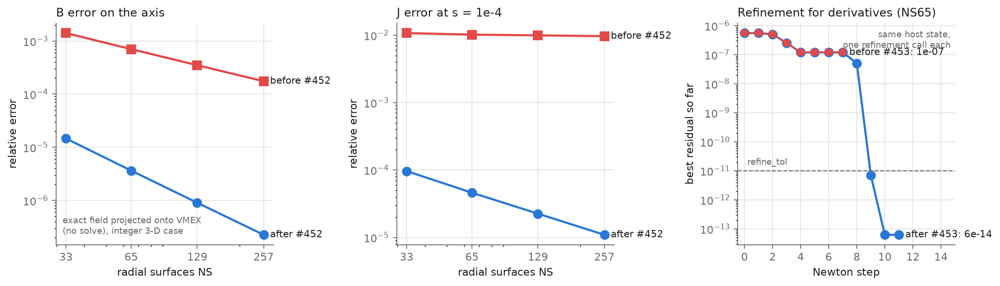

## How VMEX, VMEC2000, VMEC++ and DESC compare

All three VMEC-type codes read the same generated input deck. Every output is scored by the same script ([benchmarks/score_wout_exact.py](benchmarks/score_wout_exact.py)) against the exact solution. DESC runs at its own spectral resolution.

- **Same equations, same answer.** VMEX and VMEC2000 give identical equilibria on every case, including the ones where both fail. VMEC++ agrees wherever it converges. VMEX's gain is not a different solution of the same equations.
- **Where VMEX is more accurate: reading fields out of an equilibrium.** From one VMEC2000 equilibrium, VMEX's continuous field gives J 10–70× more accurately than the standard WOUT output between s = 0.25 and 0.75, and about 2.5× near the edge. On the first few surfaces next to the axis it is worse; that remaining near-axis error is an open item.
- **Hard cases.** From a cold start, none of the VMEC-type codes reaches the integer 3-D or sheared-A equilibria (flux-surface errors of 10–50%). VMEX does reach integer 3-D when seeded from the exact state. VMEC++ writes no output on those cases and crashes on the asymmetric deck.
- **DESC is the most accurate code here, especially at the axis.** Integer 3-D converges spectrally (volume J error 1.5e-3 at M=6 down to 1.9e-6 at M=12). Its axis offset shrinks at the same rate. It recovers sheared A, although it hit its iteration cap there. No DESC defect was found.

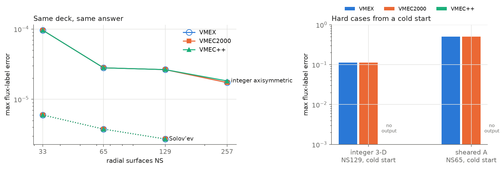

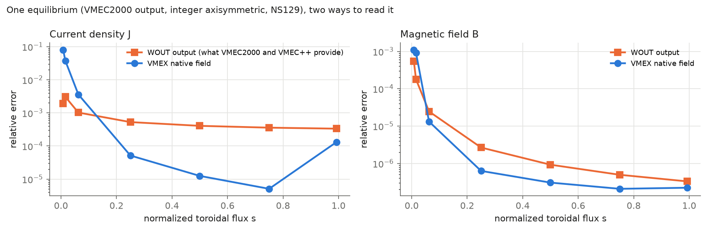

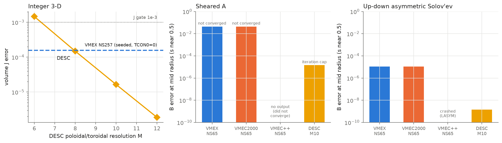

**Open:** VMEX near-axis current in solved states (about 1e-2 in the first cells, after #452); VMEX recovery of sheared A; the VMEC++ asymmetric-input crash (not yet reported upstream).

Code versions: VMEX `3b73d6f` (main, with #452), VMEC2000 from STELLOPT `3e1439d`, VMEC++ 0.5.2, DESC `4f48720`. Per-run receipts, logs and scores are under [results/cross_code](results/cross_code) and [results/desc](results/desc); the figures are drawn from saved records only ([manifest](figures/highlight_manifest.json)).

The primary references are [Landreman's analytical equilibria](https://arxiv.org/abs/2609.26742), their [supplementary implementation](https://github.com/landreman/analytic_3d_equilibria), and an explicitly derived asymmetric Solov'ev case. The implementation plan and continuing logbook are in [plan.md](plan.md). Start a local implementation session with [AGENT_PROMPT.md](AGENT_PROMPT.md).

## Current VMEX results (continuation of 05e9473, September 2026)

Historical VMEX `b5f5267` unless stated. "Point cloud" means fixed Cartesian sample points, not a resolved volume norm. Full records, commands and hashes are in the [logbook](plan.md#17-continuing-logbook).

| Question | Result | Evidence level |
|---|---|---|
| Does the refinement observer see real corrections? | The old observer measured a memo hit. The saved NS65 zero-TCON0 "base" was already refined (raw 5.5e-7 → 1.19e-7); a second uncached pass certifies a root at 6.2e-14 in the same operator | Certified root |
| Do saved NS65 branch endpoints satisfy the base linearization? | Yes: defect `A d_h + F_P q_h` falls as h² (3e-4 → 3e-8) with zero frozen-data drift | Linear-operator check |
| Axisymmetric c (nonzero) and delta (null) responses, NS129 | c: 1.6e-5 relative error; delta null: E_B = 1.6e-6 (JVP with matched input tangent), branch FD 1.3–1.6e-6; root, linear, transpose and FD-window gates pass | Pointwise certificate (4 points) |
| Null response versus NS (branch FD, 96 points) | 1.1e-3, 1.2e-3, 2.9e-4, 4.4e-6 for NS 17/33/65/129 | Point cloud |
| Integer 3-D, NS129/257 zero TCON0, full volume | Mid-radius and edge meet the B/J/force gates (edge B 2.5e-7 at NS257); volume J/force fail in the first 2–3 axis cells | Resolved grids, bounded failure |
| Cause of the axis failure | (1) VMEX field evaluator copies the first surface into the regular axis row: first-order axis B, NS-independent near-axis J. Fixed upstream in [uwplasma/vmex#452](https://github.com/uwplasma/vmex/pull/452) (unmerged). (2) After that fix a solver-side near-axis J defect remains (open) | Source-confirmed; reproducers included |
| Default versus zero TCON0 | Integer 3-D NS129: zero is better on every grid. Sheared-A NS17: the default converges, zero caps. No global recommendation | Matched pairs |
| Sheared A | Full-flux lambda reproduces the surface field to 1.6e-10; NS65 exact projection meets J/force gates (B 1.06e-5; 9.9e-6 at MPOL 17). Seeded solves drift away from it, cold multigrid fails (flux label error 0.46) | Projection only; solver limitation open |
| LASYM | Symmetric problem with LASYM=T reproduces LASYM=F to round-off; genuine asymmetric Solov'ev converges (NS65 B 2.2e-5, fitted-state route) | Solver-state control |
| Exact field-line flow, MGRID | Closed-form flow, tangent map, det = 1 and scaling tests pass; MGRID interpolation of an exact harmonic field is second order | Interface fixtures |
| Direct integer-family optimization | No substantive C_J/C_B tradeoff: both objectives are driven to minimum beta and asymmetry | Documented limit |

## Results currently included

These are **analytical reference results, not VMEX solver results**. The original reference suite passed 29 tests, and sampled force identities passed on 14 configurations. The latest clean Python 3.12 reference-environment run passes 55 tests with VMEX absent; it does not measure solver accuracy. The largest sampled force RMS divided by pressure-gradient RMS was 1.66e-15. Tests also cover an independent Grad-Shafranov identity, volume and toroidal-flux integrals, coordinate covariance, current integration, flux inversion, field Jacobians and sensitivity cancellations.

| Reference | Volume-averaged beta | Axis iota, counterclockwise R-Z convention |
|---|---:|---:|
| Integer 3-D, epsilon=0.5, delta=1/64 | 3.50877193% | -2.00000000 |
| Sheared A | 19.66235650% | -5.68886661 |
| Sheared B | 7.46725404% | -4.36231483 |
| Sheared C | 14.09668185% | -3.88989400 |

The paper uses the opposite poloidal orientation. The signs above are deliberate; the local VMEX parser/field conversion still needs its own physical-vector check. The exact field's derivative with respect to the integer family's outer label is zero at a fixed interior Cartesian point. The sheared transform's lambda derivative also vanishes; measured explicit-reference values and Taylor curves are in [results/reference/derivatives.json](results/reference/derivatives.json).


## Run the reference checks

Run from the repository root in a dedicated environment:

```sh
python -m venv .venv
. .venv/bin/activate
python -m pip install -r requirements.txt
python -m pytest -q
python benchmarks/verify_reference.py
python benchmarks/reference_derivatives.py
python benchmarks/build_inputs.py
python benchmarks/plot_results.py
```

The scripts use float64. Recorded package versions and machine information are in [results/reference/identities.json](results/reference/identities.json); test and command evidence is in [results/reference/execution.json](results/reference/execution.json). Exact local versions, rather than an assumed latest release, must accompany later solver results. Python 3.12 or newer is a practical starting point for the separate current-VMEX environment; resolve its actual dependency constraints during phase P0.


### Axisymmetric exact-family input sensitivity

Central differences of the complete axisymmetric integer-family input map use the existing boundary Fourier fit, pressure/iota/current polynomial fits, held-out profile values, `PHIEDGE`, `CURTOR`, and the converted current-shape coefficients. The fit degrees stayed fixed at 8 across perturbations from `1e-2` to `1e-5`. Successive complete-vector derivative estimates changed by `5.66e-8` for the vertical-scale parameter `c` and `1.20e-9` for the outer-label parameter `delta`. The independently known beta derivatives agree within `5.0e-14` and `1.9e-10` absolute at the finest step. An independent 512/1024-point Ampere loop integral agrees to `3.34e-16` in normalized enclosed current; its finite-difference `dI/ds` agrees with the input `AC(s)` profile within `4.2e-12` relative, and the physical `CURTOR` scaling agrees exactly at recorded precision. At one fixed interior Cartesian point, `dB/dc` is nonzero and its central difference approaches the JAX derivative to `3.21e-11` relative; `dB/ddelta` is exactly zero. This is analytical input-map evidence, not a VMEX solver-response derivative. The full step ladder and coefficient/profile derivatives are in the immutable [axisymmetric derivative report](results/reference/derivative_runs/axisym-input-map-20260924T201351.596655Z/derivatives.json).

## First measured VMEX recovery

At the pinned VMEX baseline, the axisymmetric integer case converged with prescribed iota at three cold radial resolutions. Errors use 96 native Cartesian field samples on a 3×8×4 physical-volume quadrature. They compare the solved state with the independent exact field; `J` is the curl of native `B`, and the pressure gradient uses VMEX's inverted flux coordinate and parsed pressure profile.

| NS | B relative L2 | J relative L2 | Force RMS / exact pressure-gradient RMS |
|---:|---:|---:|---:|
| 33 | 5.76e-5 | 2.58e-2 | 2.88e-1 |
| 65 | 7.90e-6 | 2.49e-3 | 2.76e-2 |
| 129 | 6.51e-7 | 8.24e-5 | 8.18e-4 |

The `NS=129` prescribed-iota run meets the initial single-run B, J and force targets. Its largest normalized discrete force component was 9.66e-15. The current-prescribed `NS=129` run also meets them: B error 6.89e-7, J error 8.25e-5 and force ratio 8.18e-4. The near-axis sample was the main source of the larger `NS=65` current/force error. A current-prescribed multigrid run at `NS=65` gave B error 7.97e-6, J error 2.49e-3 and force ratio 2.75e-2, with current and force still above their planned targets. This is one fixed-boundary physical case; independent angular refinement and the other required geometries remain open. All run records and native sample arrays are in [results/vmex](results/vmex).

The separate exact symmetric Solov’ev projection into VMEX’s continuous basis had sampled B relative L2 error from 1.59e-12 to 1.06e-12 over 2, 4 and 8 degree-5 spline spans. It used no nonlinear solve and its strong-force certificate showed a finite floor. See [the projection record](results/projection/solovev_symmetric.json); this basis check is separate from the solved state’s native field interpolation.

For the genuinely asymmetric Solov’ev input, the discrete solve converged at `NS=33, 65, 129`. VMEX’s live Cartesian interior field API currently rejects LASYM. Its WOUT surface field route does accept LASYM: the worst of five area-weighted surface B errors decreased from 1.26e-4 to 3.15e-5 to 7.86e-6. These are surface B checks only. A continuous fitted-state lift was also tried, but fixed span caps made its errors much larger and could reverse their refinement trend; failed trials and arrays remain in [results/vmex](results/vmex). No LASYM volume current/force recovery is certified.

A same-deck [LASYM WOUT restart round trip](results/vmex/solovev_asymmetric_iota_ns129/lasym_roundtrip.json) reconstructed a native state and regenerated WOUT at NS=33, 65 and 129. On five surfaces per resolution, the largest geometry difference from the original WOUT was 1.4e-17 m and the largest relative surface B difference was 3.42e-14. This tests serialization and surface reconstruction; the live Cartesian LASYM volume path remains unavailable.

The first cold 3-D integer prescribed-iota attempt at NS=33 [did not converge](results/vmex/integer_3d_iota_ns33_niter3000/attempt_history.json). VMEX reported an initial Jacobian sign change, improved its axis guess, and ended with `MORE ITERATIONS REQUIRED` at both 3,000 and 30,000 iterations. The final reported normalized force components at 30,000 were 1.15e-10, 8.18e-11 and 4.54e-11; no solved field was scored. This is a failed initialization/solver attempt, not a test of the analytical field's validity.

For the same integer 3-D case, direct physical-field reconstruction shows that the supplied geometric angle has a vanishing lambda gradient to roughly 1e-10 of the flux scale on three sampled surfaces; its measured transform is -2. An [exact-geometry VMEX state projection](results/projection/integer_3d_vmex_ns129/native_scores.json) then reaches native volume B/J/force errors of 2.42e-7 / 7.14e-6 / 8.15e-5 at NS=129, with no nonlinear solve. Its sampled WOUT surface B error is 8.86e-6 at that resolution.

Strict warm recovery from the projected NS=33 state [still failed](results/vmex/integer_3d_iota_ns33_niter3000_projected/attempt_summary.json) at 3,000 iterations. Explicitly looser `FTOL=1e-10` roots returned at NS=33,65,129, but their native physical errors remained above the initial targets; at NS=129 they were B 1.30e-4, J 2.92e-3 and force ratio 1.74e-2. [The measured comparison](figures/vmex_integer_3d_projection.png) keeps projection and loose-root results separate. The cause of the solver trajectory’s physical displacement remains unresolved.

A [same-grid invariant-force comparison](results/vmex/integer_3d_raw_residual_comparison.json) found projected NS=129 VMEX `(FSQR, FSQZ)=(1.47, 5.34)` despite its small independent physical errors. Reconstructed loose-root WOUTs returned components near `1e-10`, agreeing with saved solver values to within `6.5e-15`. This is a discrete residual versus physical-field discrepancy, not accepted recovery or a diagnosed cause.

The comparison was repeated with VMEX's actual warm-start boundary transfer and constraint-baseline rebinding; its reported components changed only at roundoff. A [bounded NS33 warm run](results/vmex/integer_3d_short_warm_ns33_ftol1e-4/probe.json) reached `FTOL=1e-4` after 65 iterations, but native B/J/force errors had increased to `1.51e-3 / 0.326 / 3.72` from the projected seed's `2.59e-5 / 3.55e-3 / 3.78e-2`. [Its saved trajectory](figures/vmex_integer_3d_trajectory.png) shows the discrete force reduction alongside those independent physical scores. This remains diagnostic only.

The [projected NS33 force localization](results/vmex/integer_3d_force_localization_ns33.json) places 86% of R and 86% of Z invariant-force sums in radial rows 16–31 of 0–32, and 85% of R and 87% of Z in poloidal modes 3–6. The checked spectral block sums reproduce VMEX's scalar residuals. This rules out a force concentrated solely at the axis or fixed boundary; the cause remains open.

A [constraint-switch diagnostic](results/vmex/integer_3d_constraint_switch.json) reevaluated each saved state with VMEX's spectral-condensation strength set to zero. On the NS33 projection, R/Z invariant residuals fell from `0.254/0.919` to `8.51e-7/9.99e-7`; at NS129 they fell from `1.47/5.34` to `5.17e-8/6.18e-8`. The state and independent physical scores did not change in this evaluation. The large projected VMEX residual is therefore dominated by its coordinate constraint.

A [bounded NS33 coordinate/lambda scan](results/projection/integer_3d_gauge_scan_ns33.json) tried 16 single-mode poloidal shifts with the compensating Clebsch lambda. Its best sampled shift lowered `FSQR+FSQZ` from `1.17` to `0.791`, still far above the strict solver tolerance. After finite VMEX projection, native B/J/force errors were `3.12e-5 / 4.67e-3 / 5.14e-2`, versus `2.59e-5 / 3.55e-3 / 3.78e-2` for the unshifted seed. This limited scan neither preserves the sampled field to roundoff nor recovers an accepted root.

For that selected shift, an [independent continuum chart check](results/projection/integer_3d_gauge_surface_continuum.json) reconstructed B with relative error decreasing from `1.82e-8` at finite-difference step `2e-4` to `1.05e-10` at `1e-5`. The separate [VMEX surface projection check](results/projection/integer_3d_gauge_surface_vmex.json) found geometry maximum error `2.06e-9` and B relative error `2.06e-5` at `s=0.5`; the unshifted state’s surface B error there was `1.57e-5`. The continuum gauge identity is sound, while this finite representation and field route remain above the surface B target.


### Independent NS33 fixed-state measurement: unresolved

On the historical VMEX pin, an independent full-torus scorer reproduced the saved legacy B/J/grad-p samples to relative RMS `2.20e-15 / 1.12e-13 / 2.85e-14`. The legacy weights sum to half the exact NFP=2 torus volume (`0.13356` versus `0.26711 m³`), although that common factor cancels in normalized ratios. On 16×64×64 Gauss nodes, `E_B/E_J/E_gradp/E_F,p` are `1.737e-3 / 0.1628 / 8.069e-3 / 1.744`; at 32×64×64 they are `1.246e-3 / 0.1804 / 8.050e-3 / 1.944`. The 32-point midpoint result is `9.083e-4 / 0.2099 / 8.039e-3 / 2.276`. At 64×64×64, Gauss gives `1.425e-3 / 0.1830 / 8.058e-3 / 1.972`, while radial midpoint gives `1.380e-3 / 0.1941 / 8.056e-3 / 2.101`. Angular-shifted Gauss still agrees closely, but 32-to-64 radial changes and 64-point midpoint spread exceed the measurement allowance. Routes A/B agree at tested points; the B/J/force recovery thresholds fail. This state is **not accepted**. The global radial ladder is unresolved. A knot-aligned composite comparison was interrupted at the user's pause request while evaluating its first 4-point-per-cell grid. Three 2-point-per-cell stdout-only rows are preserved in an [interruption receipt](results/audit/measurement_gpu/ns33-projected-default-gpu-composite-v1/interruption.json): unshifted Gauss and angular-shifted Gauss agree closely at `E_B/E_J/E_gradp/E_F,p = 1.483413e-3 / 0.1871616 / 8.060897e-3 / 2.023258`, while cell midpoint gives `1.380250e-3 / 0.1940794 / 8.056157e-3 / 2.100582`; all three reported exact-volume relative error 0. The original measurement report remains unchanged with status `running`, and has no saved measurement rows. These incomplete stdout observations are retained for context only; they do not certify radial convergence or physical recovery. A full rerun needs a fresh run ID. The [64-point report](results/audit/measurement_gpu/ns33-projected-default-gpu-radial64-v1/measurement.json) remains the latest completed, hash-linked score record.

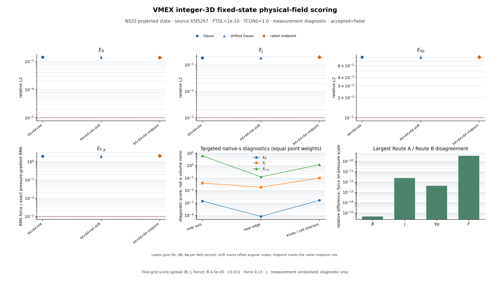


## Native VMEX and DESC coordinate comparison

These comparisons score native states at the same 96 held-out Cartesian points against the independent analytical B, J and pressure-gradient fields. Projection errors and solver outputs remain separate. VMEX is shown at `NS=129`; DESC uses angular `M=N=6` and `8`, with radial `L=8` and `10`, respectively. These resolutions and bases are not equivalent, so the plots compare measured physical errors, not solver rank.


For the integer 3-D case, the VMEX exact-state projection at `NS=129` scores B/J relative L2 errors `2.42e-7 / 7.14e-6`; its separate loose-tolerance solved state scores `1.30e-4 / 2.92e-3`. DESC's base-chart projection improves from `4.84e-4 / 1.10e-2` at `M=N=6` to `4.69e-5 / 9.65e-4` at `M=N=8`. Its fixed-boundary force-balance solve at `M=N=8` reaches `1.05e-5 / 1.48e-4` and force RMS divided by exact pressure-gradient RMS `1.91e-5`.

The DESC remap is `theta_new = theta_old + 0.1 s(1-s) sin(2 theta_new)`, with the compensating lambda and unchanged physical boundary. At `M=N=6`, remapping raises projected J error from `1.10e-2` to `3.55e-2`, while converged base/remapped solver outputs agree to about `0.1%` in both B and J error. At `M=N=8`, the remapped projection scores `5.85e-5 / 4.10e-3`; after 120 iterations its terminal state scores `1.60e-5 / 2.25e-4`, but DESC reports that the optimizer did not converge. That point is shown as an open triangle and is not counted as a recovered equilibrium. The base/remapped results show finite-projection sensitivity and recovery compensation in DESC; they do not certify gauge-independent derivatives or show that mismatch is harmless in general.

An independent continuum check of this remap reconstructs B from the flux-scaled Clebsch lambda and differentiates the mapped covariant field to obtain curl B. Across five interior surfaces, B relative L2 error was at most `2.59e-10`; curl-B relative L2 error was at most `1.16e-4` over the radial-step study. The map derivative `d(theta_old)/d(theta_new)` stayed between `0.95` and `1.05`, and the oriented Jacobian kept its sign on all sampled nodes. This is a sampled continuum B/J certificate for one remap; it does not certify DESC or VMEX equilibrium-response derivatives, all volume points or other gauge modes. The record is [results/projection/integer_3d_gauge_volume_continuum.json](results/projection/integer_3d_gauge_volume_continuum.json).

The maximum exact-LCFS fit error was `5.95e-5 m` at DESC `M=N=6, L=8` and `4.15e-6 m` at `M=N=8, L=10`; the remapped and base boundaries agree to the reported precision. DESC's minimum sampled volume Jacobian stayed positive (`3.95e-3` to `4.06e-3` in the 3-D samples). These are sampled/projection checks, not a global proof that the coordinates remain regular everywhere.

The axisymmetric integer control gives a separate check. DESC `M=N=6, L=8` projection errors are `1.12e-5 / 2.15e-4`; after six optimizer iterations they are `1.99e-6 / 8.72e-6`. The VMEX `NS=129` solved control is `6.51e-7 / 8.24e-5`. Its higher radial resolution precludes a direct rank claim.


### Axisymmetric equilibrium response: frozen path versus resolved roots

The first NS17/33/65 residual-level response study includes signed block-scaled input tangents, a transpose pairing check, exact fixed-point field and volume-beta derivatives, finite differences along the frozen linearized path, and independently reconverged branch finite differences. An independent dense 568-DOF residual Jacobian at NS17 matches the block/Krylov response to `4.84e-12` (`c`) and `6.09e-12` (`delta`) relative state L2, certifying the smallest-rung linear solve. At NS65 the nonzero `c` field derivative differs from the exact reference by `8.11e-5` relative L2 and the volume-beta derivative by `1.73e-8` absolute. For the exact-null `delta` field direction, frozen-path finite differences approach the VMEX JVP to `1.27e-6` in the fixed scale as the step falls to `3e-6`; independently reconverged roots remain `5.92e-3` away from that JVP at step `1e-4`. The two derivative checks therefore disagree, and no derivative is certified. All four fixed Cartesian branch points remain valid and their centered field differences are bitwise identical for coordinate-inversion iteration caps 8, 12 and 24, ruling out under-iterated field inversion as the cause at those points. The saved [response report](results/vmex/response_runs/axisym-root-response-20260924T232219.753772Z/response.json), [inversion audit](results/audit/axisym_branch_inversion/axisym-branch-inversion-20260925T000119.473037Z/inversion_audit.json), and [figure manifest](results/vmex/axisymmetric_response_figure_manifest.json) preserve the distinct evidence paths.

A follow-up at `h=1e-5` applies the physical-field JVP along the measured branch-state finite difference. It matches the branch B-FD within `6.98e-3` relative, while the residual-level JVP differs from branch B-FD by `5.92e-3` in the fixed scale. This points to the equilibrium-root/state response as the unresolved part, rather than the local field reconstruction. The derivative remains uncertified; see the [saved decomposition report](results/audit/axisym_branch_jvp_decomposition/axisym-branch-jvp-20260925T001031.029246Z/branch_jvp_decomposition.json).

A 96-point, six-surface extension fits much of the NS65 `m=1` geometry gap with a radial relabel candidate. It reduces the residual-tangent versus branch field-response discrepancy from `2.88e-2` to `1.84e-3`; a centered candidate finite difference differs from the branch by `1.89e-3`. Yet that candidate changes physical B by `1.84e-1` in the fixed response scale, while the exact integer-family `delta` derivative at fixed Cartesian points is zero. The measured branch response itself is `1.84e-1`; the measured-state field JVP matches it within `1.78e-4`. All 96 base/plus/minus coordinate inversions are valid and the base native-flux-label error is `1.64e-5`. The radial fit therefore tracks a physically displaced branch response; it fails the field-invariance test and is not a gauge explanation. No derivative or coordinate transformation is accepted. See the [saved report](results/audit/axisym_radial_relabel/axisym-relabel-field-20260925T010115.952375Z/radial_relabel_field_test.json) and [figure manifest](results/audit/axisym_radial_relabel/branch_alignment_figure_manifest.json).

A matched NS65 `TCON0=0` exact-null `delta` branch was also attempted with the same `h=1e-5` perturbations and 96 fixed Cartesian points. The solver returned all three states, but post-refinement residuals were `1.19e-7`, `8.42e-8` and `1.21e-7`, or 8,423–12,101 times the `1e-11` root certificate tolerance. Its branch B finite-difference norm was `0.398`, versus `0.184` for the saved `TCON0=1` branch, but this is not a valid constraint-response comparison because none of the zero-strength roots was certified. The original report's “anchored diagnostic root” label is superseded by a separate residual-based amendment; its raw bytes remain unchanged. No constraint-default conclusion follows. See the [probe report](results/audit/axisym_branch_tcon0/axisym-tcon0-branch-20260925T010824.995851Z/tcon0_branch_probe.json) and [status amendment](results/audit/axisym_branch_tcon0/axisym-tcon0-branch-20260925T010824.995851Z/root_status_amendment.json).

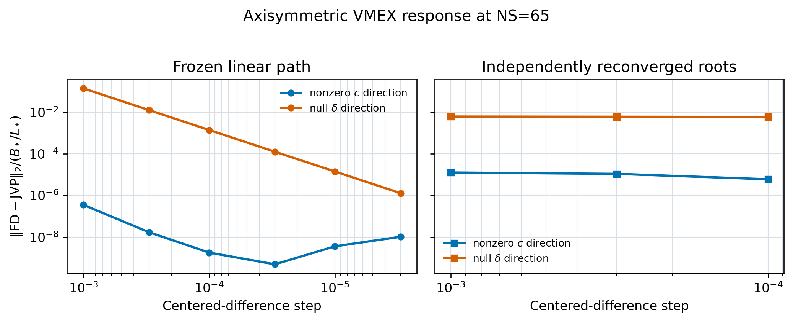

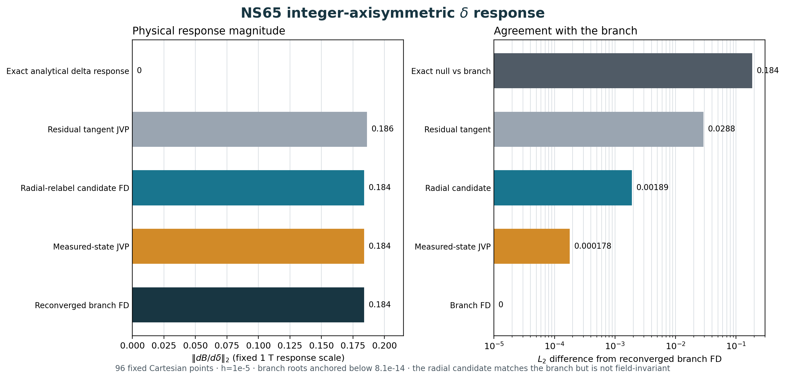

### Sheared-A current-closure recovery (diagnostic)

At historical VMEX NS17, both the cold current-prescribed solve and a solve started from a lambda-zero projection of exact R/Z surfaces capped at 10,000 iterations. The exact geometry projection matches the processed edge coefficients to about `1e-16 m` and has small native/reference flux-label error (`2.68e-5` max), but its B/J errors are `0.134 / 0.265` and force-over-pressure scale is `1.21` because the full straight-field coordinate map is absent. The capped projected-start state scores `0.0169 / 0.0715 / 0.227 / 0.173` for B/J/gradp/force; the cold terminal state scores `0.00689 / 0.0467 / 0.0857 / 0.174`. The projected-start flux-label error grows to `0.175` max. Neither state converged or passed acceptance. These records show that exact R/Z geometry with `lambda=0` is not an adequate magnetic seed; they do not establish a general solver limitation. See the [projection report](results/projection/sheared_A/sheared-A-projection-20260924T235541.410475Z/projection.json) and [projected-start solve report](results/vmex/runs/sheared-a-ns17-projected-terminal-20260924/forward.json).

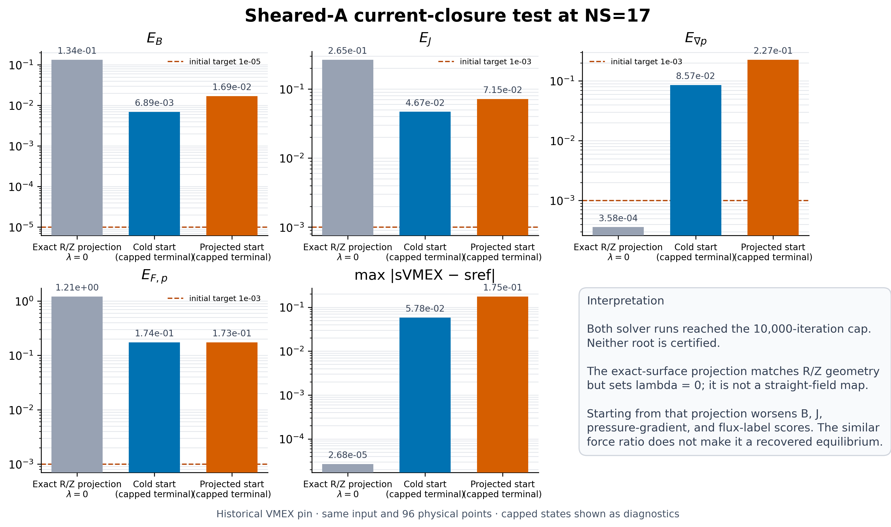

The matched [figure manifest](results/vmex/sheared_a_ns17_figure_manifest.json) verifies one historical VMEX pin, one input deck, and byte-identical 96-point physical sample grids for the three displayed states.

Solving the periodic field-line equation on the exact sheared-A surfaces gives a nonzero lambda map. Its 48×48 solve is independently checked on a 64×64 grid: the relative straightness residual is `7.07e-10`, `3.34e-9`, and `5.63e-9` at normalized flux `s=0.25, 0.65, 0.94`; the retained VMEX Fourier fit error is at most `1.45e-6` relative on those surfaces. Projecting this map into the same NS17 exact R/Z geometry lowers the matched 96-point B/J errors from `0.134 / 0.265` to `7.07e-4 / 5.13e-3`; force divided by pressure-gradient RMS falls from `1.21` to `2.44e-2`. The grad-p error stays `3.58e-4` because the geometry and flux labels are unchanged. A bounded current-prescribed VMEX solve from that mapped seed converged in 208 iterations at `FTOL=1e-10`, with FSQR/FSQZ/FSQL `9.81e-11 / 7.05e-11 / 3.11e-11`. On the same points its B/J/grad-p/force scores became `1.51e-3 / 3.14e-2 / 1.50e-3 / 0.142`; these are worse than the mapped seed, although better than the earlier capped starts. It missed the physical score thresholds, and its maximum flux-label error increased from `2.68e-5` to `7.25e-4`. A matched one-off `TCON0=0` run from the identical seed began with FSQR/FSQZ `3.13e-6 / 3.06e-6`, but oscillated through the 10,000-iteration cap. Its B/J/grad-p/force scores were `6.44e-3 / 4.61e-2 / 8.02e-2 / 0.175`, with maximum flux-label error `5.26e-2`. For this seed, removing the penalty did not produce a better root; this single NS17 comparison does not establish a general effect. Neither solver result is accepted or spatially resolved. The [field-line map report](results/projection/sheared_A/sheared-A-straight-field-20260925T004606.885805Z/straight_field_projection.json), [TCON0=1 run](results/vmex/runs/sheared-a-ns17-straight-field-terminal-20260925/forward.json), [TCON0=0 run](results/vmex/runs/sheared-a-ns17-straight-field-tcon0-zero-terminal-20260925/forward.json), and [matched figure manifest](results/projection/sheared_A/lambda_recovery_figure_manifest.json) preserve this distinction.

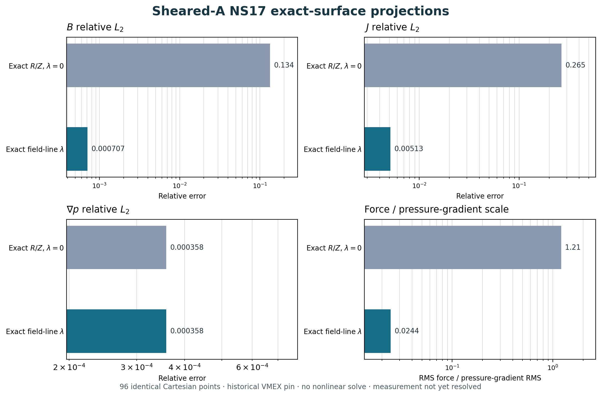

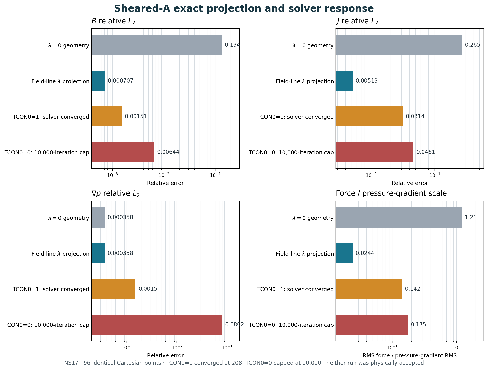

### VMEX coordinate-constraint ladder

The historical TCON experiment used VMEX `b5f5267` and saved nine unique integer-3D solver records at NS33, NS65 and NS129. The raw reports, score files and 96 point sample arrays are preserved. Review showed that the old plotting script overwrote iteration counts, software/runtime labels, command strings, and post-hoc acceptance flags in those reports. Their original values cannot be recovered from the reviewed Git history, so the new summaries omit them and retain the saved field/current/force scores only as **legacy96 diagnostics**. Independent score convergence has not yet been established.

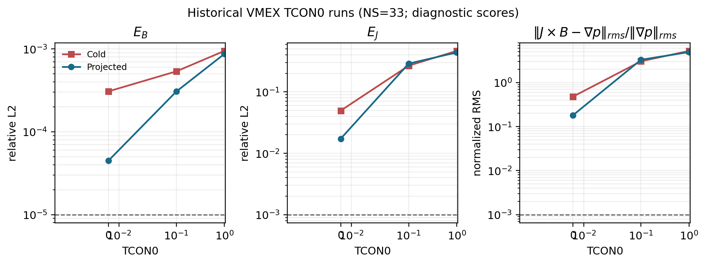

Within those saved scores, the projected zero-constraint NS33 state had `E_B=4.48e-5`, `E_J=1.73e-2`, and force ratio `0.182`, versus `8.71e-4`, `0.439`, and `4.93` at deck-default strength. Both states miss at least one physical target. The cold-start comparison changes the label-drift trend, and the sampled scores are not yet certified against shifted/refined quadrature. These observations do not support a global default change or a solver redesign.

The [read-only summary](results/audit/tcon_reinterpretation/ns33_summary.json), [resolution summary](results/audit/tcon_reinterpretation/resolution_summary.json), and [historical amendment table](results/audit/tcon_reinterpretation/historical_amendments.json) link each included metric to immutable source files and hashes. These new figures exclude iteration counts, commands, and acceptance annotations injected by the old renderer. The prior figures and summaries remain available as historical artifacts but are superseded for interpretation.

These runs prescribe iota. The cold zero-strength run's larger label drift shows that the finite-dimensional coordinate response is initialization-sensitive in this sample. The projected NS129 zero-strength run is now complete at the historical VMEX pin: it converged in 50 iterations at `FTOL=1e-10`, from the same input and seed as the default-strength run. Its saved 96-point errors are substantially smaller, but its measurement remains unresolved and the run is not accepted. See the matched comparison below. Measure Jacobian regularity, high-mode content and gauge/derivative stability before drawing a design conclusion or changing the default.

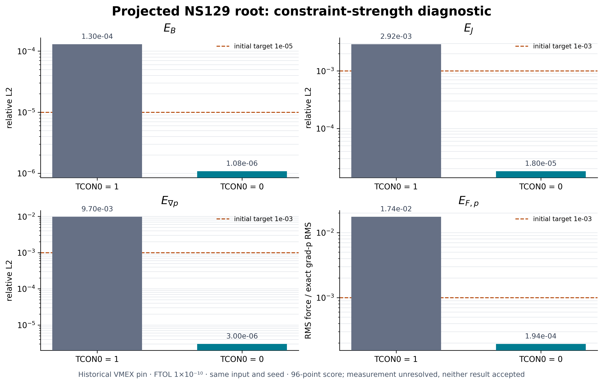

On the common 96-point diagnostic grid, `TCON0=0` scores `E_B=1.08e-6`, `E_J=1.80e-5`, `E_gradp=3.00e-6` and `E_F,p=1.94e-4`, versus `1.30e-4`, `2.92e-3`, `9.70e-3` and `1.74e-2` at `TCON0=1`. Both solver calls converged, in 50 and 420 iterations respectively, using the same projected seed and historical source. The saved point locations agree to `2.3e-16 m` and their weights to a maximum relative difference of `2.6e-10`. This is a strong finite-sample diagnostic result, not evidence of measurement convergence, a certified root, resolution convergence or a global constraint recommendation. The figure manifest records both report hashes, sample hashes and the grid comparison.

The projected-start radial check supports that caution. At `NS=65`, zero strength reaches `E_B=8.26e-6` but still has `E_J=1.51e-3` and force ratio `1.67e-2`; default strength scores `7.06e-4 / 1.49e-1 / 1.70`. At `NS=129`, the default result is `1.30e-4 / 2.92e-3 / 1.74e-2`; the matched zero-strength diagnostic is `1.08e-6 / 1.80e-5 / 1.94e-4`. These scores are from the legacy 96-point sample and do not yet form a resolution-converged recovery result.

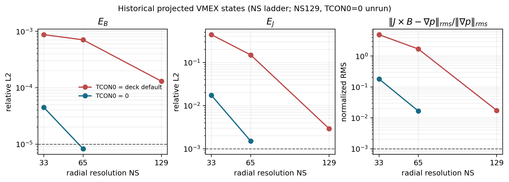

At NS65, the saved zero-strength score is `8.26e-6 / 1.51e-3 / 1.67e-2`; deck-default strength scores `7.06e-4 / 1.49e-1 / 1.70`. At NS129, the saved default score is `1.30e-4 / 2.92e-3 / 1.74e-2`, while the new projected zero-strength result is `1.08e-6 / 1.80e-5 / 1.94e-4`. The NS129 values remain diagnostic legacy96 measurements; the denser scorer and root/representation gates are still open.

DESC used the pinned source revision in [sources.json](sources.json), version `0.17.3+27.g4f48720be`, JAX `0.6.2`, float64 and one CUDA device. Its environment record is [results/desc/environment.json](results/desc/environment.json). It prescribed the DESC rotational-transform profile `+2`; the transform was not independently measured in these runs. Projection/solved scorer records, compressed held-out arrays, equilibrium files and figure input hashes are under [results/desc/coordinate](results/desc/coordinate). The report records timings and peak resident memory. These measurements are a first native comparison, not the full P3 exit: current-closure checks, more remaps, explicit transform measurement, independent source/test review, higher-resolution VMEX TCON0 comparisons, VMEC2000/VMEC++ and GVEC comparisons, and derivative stability remain open.

## Candidate VMEX inputs

`inputs/` contains 28 generated INDATA candidates: 14 configurations, each with prescribed iota and prescribed current. The current profile is generated from an independent Ampere integral and converted to VMEX's derivative-profile convention. Pressure, flux and geometric scales are recorded in [inputs/manifest.json](inputs/manifest.json).

The regenerated boundary candidates use `(MPOL, NTOR) = (17, 96)` for sheared B and `(25, 100)` for sheared C. Their independent sampled Fourier-fit maxima are 8.59e-9 m and 3.34e-7 m at a 1 m length scale, below the 1e-6 m smoke gate. VMEX's pinned parser and setup accepted all 28 candidates: their sign map has `signgs=-1` and no unexpected theta flip, and sampled pressure, iota or normalized current agree with the independent reference fits. The details are in [results/inputs/vmex_parser.json](results/inputs/vmex_parser.json). These checks do not certify the final output error budget or an equilibrium solve.

The [sheared-chart check](results/reference/sheared_chart.json) sampled all six sheared variants on five radii, 64 poloidal labels and 513 toroidal nodes, plus 1024 independent physical-angle inversions per case. Every sampled angle map was monotone; the smallest normalized angular slope was 0.436 for sheared C. A [local implicit-root JVP check](results/reference/sheared_derivative.json) compared physical-position directional derivatives with independent central differences at four steps for two interior points each in A, B and C. Its smallest directional errors per point were 7.38e-13 to 1.95e-12 in reference length units. The branch-boundary and full input-map derivatives remain untested.

A [near-domain probe](results/reference/sheared_domain_edges.json) found that the smooth analytical domain does not alone guarantee a single-valued physical-angle chart. In sheared C with `S - asin(sqrt(2 edge))` of 0.001, 0.01 and 0.1, sampled minimum angle slopes were -3.22, -2.22 and -0.209, with three chart crossings at selected physical angles. The new sampled graph guard rejects these inputs before deck generation. The tested margins 0.2 and above had positive sampled slopes; their graph validity outside the sample is unproved.


After installing the pinned VMEX and its dependencies in a separate local environment:

```sh
python benchmarks/run_vmex.py inputs/input.integer_axisymmetric_iota
python benchmarks/run_vmex.py inputs/input.integer_axisymmetric_current
python benchmarks/run_gradient_smoke.py inputs/input.integer_axisymmetric_iota
```

The forward runner now saves native Cartesian samples and physical scores after a converged solve. The gradient smoke remains unrun; it varies only PHIEDGE at fixed boundary and profiles and does not differentiate the complete analytical family. Complete the other recovery and derivative checks in phases P2-P4 before broader claims.

The shared scorer accepts an NPZ file of **native physical samples**, with its contract in the script and plan:

```sh
python benchmarks/score_samples.py samples.npz scores.json
```

It compares Cartesian B, J and grad p against the reference at the same points. Sampled scores are diagnostic until the experiment's resolution and error gates have been applied; a report marked `accepted: false` has not passed those gates.

## Study coverage

The [execution matrix](benchmark_matrix.json) records implemented, planned and blocked experiments. The plan covers axisymmetric and non-axisymmetric equilibria, LASYM=F/T, genuine asymmetric Solov'ev physics, exact coordinate changes, both current/transform closures, field derivatives, implicit responses, file/restart paths, Boozer and bounce diagnostics, polishing, free-boundary operators and coupled roots, source fitting, optimization and scoped adjacent-code integrations.

An exact interior field is not automatically an exact free-boundary solution. The free-boundary plan distinguishes exact vacuum/operator tests, independently converged numerical coupled equilibria, and approximate exterior fits to an exact interior target. Genuinely symmetry-broken 3-D extensions outside the exact families also require numerical references. These distinctions are part of the benchmark, not missing labels to be filled with assumed answers.

The fixed-boundary VMEX recovery and first fixed-boundary DESC comparisons described above are the nonlinear solver measurements so far. No free-boundary or kinetic benchmark has run. The [public benchmark repository](https://github.com/rogeriojorge/vmex-benchmark-analytical) was created using the verified owner's authentication. [The source review](docs/SOURCE_REVIEW.md) identifies inspected paths and the full local semantic audit still needed; an inventory and focused parser review are not a whole-source semantic review.

## Local source inventory and publication

Resolve the used pins in `sources.json`, locate checkouts outside this repository, then run:

```sh
python tools/audit_sources.py /absolute/path/to/checkouts
sh tools/publish.sh
# Read the staged diff before authorizing publication:
PUBLISH=1 sh tools/publish.sh
```

The inventory tool does not mark files reviewed. The publication helper verifies the authenticated owner and configures only local Git identity; it does not force-push or rewrite history. Preserve third-party notices. Update the phase table and append a logbook entry after each meaningful experiment.

## License and references

Original code: MIT. See [NOTICE.md](NOTICE.md) for attribution and [plan.md](plan.md#references) for the scientific and implementation references. Large future state files should be checksummed release assets, while code, small numerical summaries and figure generators remain in Git.
