# VMEX analytical benchmarks

Exact toroidal equilibria, physical-field checks and a staged benchmark of VMEX's derivatives, diagnostics and free-boundary interfaces.

The primary references are [Landreman's analytical equilibria](https://arxiv.org/abs/2609.26742), their [supplementary implementation](https://github.com/landreman/analytic_3d_equilibria), and an explicitly derived asymmetric Solov'ev case. The implementation plan and continuing logbook are in [plan.md](plan.md). Start a local implementation session with [AGENT_PROMPT.md](AGENT_PROMPT.md).

## Results currently included

These are **analytical reference results, not VMEX solver results**. The reference suite passed 29 tests, and sampled force identities passed on 14 configurations. The largest sampled force RMS divided by pressure-gradient RMS was 1.66e-15. Tests also cover an independent Grad-Shafranov identity, volume and toroidal-flux integrals, coordinate covariance, current integration, flux inversion, field Jacobians and sensitivity cancellations.

| Reference | Volume-averaged beta | Axis iota, counterclockwise R-Z convention |
|---|---:|---:|
| Integer 3-D, epsilon=0.5, delta=1/64 | 3.50877193% | -2.00000000 |
| Sheared A | 19.66235650% | -5.68886661 |
| Sheared B | 7.46725404% | -4.36231483 |
| Sheared C | 14.09668185% | -3.88989400 |

The paper uses the opposite poloidal orientation. The signs above are deliberate; the local VMEX parser/field conversion still needs its own physical-vector check. The exact field's derivative with respect to the integer family's outer label is zero at a fixed interior Cartesian point. The sheared transform's lambda derivative also vanishes; measured explicit-reference values and Taylor curves are in [results/reference/derivatives.json](results/reference/derivatives.json).

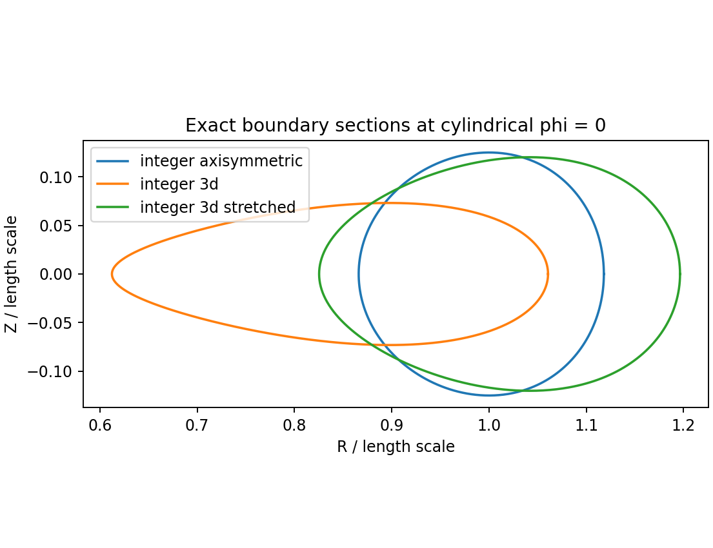

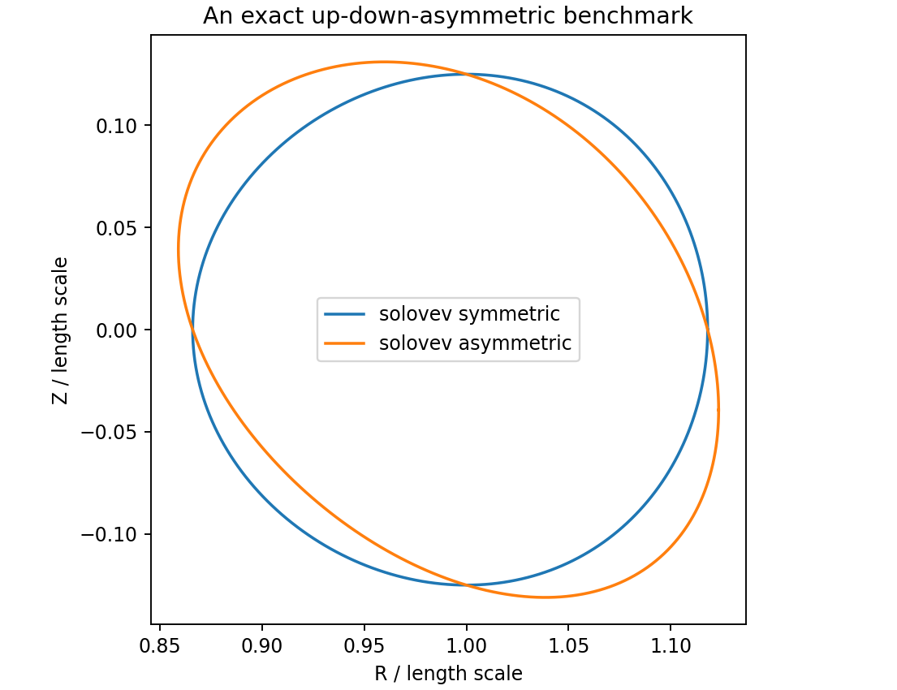

## Run the reference checks

Run from the repository root in a dedicated environment:

```sh
python -m venv .venv
. .venv/bin/activate
python -m pip install -r requirements.txt
python -m pytest -q
python benchmarks/verify_reference.py
python benchmarks/reference_derivatives.py
python benchmarks/build_inputs.py
python benchmarks/plot_results.py
```

The scripts use float64. Recorded package versions and machine information are in [results/reference/identities.json](results/reference/identities.json); test and command evidence is in [results/reference/execution.json](results/reference/execution.json). Exact local versions, rather than an assumed latest release, must accompany later solver results. Python 3.12 or newer is a practical starting point for the separate current-VMEX environment; resolve its actual dependency constraints during phase P0.

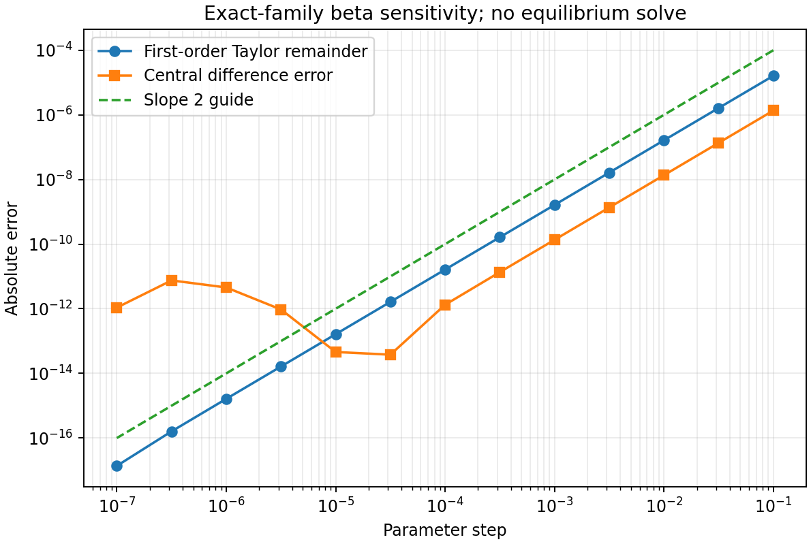

## First measured VMEX recovery

At the pinned VMEX baseline, the axisymmetric integer case converged with prescribed iota at three cold radial resolutions. Errors use 96 native Cartesian field samples on a 3×8×4 physical-volume quadrature. They compare the solved state with the independent exact field; `J` is the curl of native `B`, and the pressure gradient uses VMEX's inverted flux coordinate and parsed pressure profile.

| NS | B relative L2 | J relative L2 | Force RMS / exact pressure-gradient RMS |
|---:|---:|---:|---:|
| 33 | 5.76e-5 | 2.58e-2 | 2.88e-1 |
| 65 | 7.90e-6 | 2.49e-3 | 2.76e-2 |
| 129 | 6.51e-7 | 8.24e-5 | 8.18e-4 |

The `NS=129` prescribed-iota run meets the initial single-run B, J and force targets. Its largest normalized discrete force component was 9.66e-15. The current-prescribed `NS=129` run also meets them: B error 6.89e-7, J error 8.25e-5 and force ratio 8.18e-4. The near-axis sample was the main source of the larger `NS=65` current/force error. A current-prescribed multigrid run at `NS=65` gave B error 7.97e-6, J error 2.49e-3 and force ratio 2.75e-2, with current and force still above their planned targets. This is one fixed-boundary physical case; independent angular refinement and the other required geometries remain open. All run records and native sample arrays are in [results/vmex](results/vmex).

The separate exact symmetric Solov’ev projection into VMEX’s continuous basis had sampled B relative L2 error from 1.59e-12 to 1.06e-12 over 2, 4 and 8 degree-5 spline spans. It used no nonlinear solve and its strong-force certificate showed a finite floor. See [the projection record](results/projection/solovev_symmetric.json); this basis check is separate from the solved state’s native field interpolation.

For the genuinely asymmetric Solov’ev input, the discrete solve converged at `NS=33, 65, 129`. VMEX’s live Cartesian interior field API currently rejects LASYM. Its WOUT surface field route does accept LASYM: the worst of five area-weighted surface B errors decreased from 1.26e-4 to 3.15e-5 to 7.86e-6. These are surface B checks only. A continuous fitted-state lift was also tried, but fixed span caps made its errors much larger and could reverse their refinement trend; failed trials and arrays remain in [results/vmex](results/vmex). No LASYM volume current/force recovery is certified.

A same-deck [LASYM WOUT restart round trip](results/vmex/solovev_asymmetric_iota_ns129/lasym_roundtrip.json) reconstructed a native state and regenerated WOUT at NS=33, 65 and 129. On five surfaces per resolution, the largest geometry difference from the original WOUT was 1.4e-17 m and the largest relative surface B difference was 3.42e-14. This tests serialization and surface reconstruction; the live Cartesian LASYM volume path remains unavailable.

The first cold 3-D integer prescribed-iota attempt at NS=33 [did not converge](results/vmex/integer_3d_iota_ns33_niter3000/attempt_history.json). VMEX reported an initial Jacobian sign change, improved its axis guess, and ended with `MORE ITERATIONS REQUIRED` at both 3,000 and 30,000 iterations. The final reported normalized force components at 30,000 were 1.15e-10, 8.18e-11 and 4.54e-11; no solved field was scored. This is a failed initialization/solver attempt, not a test of the analytical field's validity.

For the same integer 3-D case, direct physical-field reconstruction shows that the supplied geometric angle has a vanishing lambda gradient to roughly 1e-10 of the flux scale on three sampled surfaces; its measured transform is -2. An [exact-geometry VMEX state projection](results/projection/integer_3d_vmex_ns129/native_scores.json) then reaches native volume B/J/force errors of 2.42e-7 / 7.14e-6 / 8.15e-5 at NS=129, with no nonlinear solve. Its sampled WOUT surface B error is 8.86e-6 at that resolution.

Strict warm recovery from the projected NS=33 state [still failed](results/vmex/integer_3d_iota_ns33_niter3000_projected/attempt_summary.json) at 3,000 iterations. Explicitly looser `FTOL=1e-10` roots returned at NS=33,65,129, but their native physical errors remained above the initial targets; at NS=129 they were B 1.30e-4, J 2.92e-3 and force ratio 1.74e-2. [The measured comparison](figures/vmex_integer_3d_projection.png) keeps projection and loose-root results separate. The cause of the solver trajectory’s physical displacement remains unresolved.

A [same-grid invariant-force comparison](results/vmex/integer_3d_raw_residual_comparison.json) found projected NS=129 VMEX `(FSQR, FSQZ)=(1.47, 5.34)` despite its small independent physical errors. Reconstructed loose-root WOUTs returned components near `1e-10`, agreeing with saved solver values to within `6.5e-15`. This is a discrete residual versus physical-field discrepancy, not accepted recovery or a diagnosed cause.

The comparison was repeated with VMEX's actual warm-start boundary transfer and constraint-baseline rebinding; its reported components changed only at roundoff. A [bounded NS33 warm run](results/vmex/integer_3d_short_warm_ns33_ftol1e-4/probe.json) reached `FTOL=1e-4` after 65 iterations, but native B/J/force errors had increased to `1.51e-3 / 0.326 / 3.72` from the projected seed's `2.59e-5 / 3.55e-3 / 3.78e-2`. [Its saved trajectory](figures/vmex_integer_3d_trajectory.png) shows the discrete force reduction alongside those independent physical scores. This remains diagnostic only.

The [projected NS33 force localization](results/vmex/integer_3d_force_localization_ns33.json) places 86% of R and 86% of Z invariant-force sums in radial rows 16–31 of 0–32, and 85% of R and 87% of Z in poloidal modes 3–6. The checked spectral block sums reproduce VMEX's scalar residuals. This rules out a force concentrated solely at the axis or fixed boundary; the cause remains open.

A [constraint-switch diagnostic](results/vmex/integer_3d_constraint_switch.json) reevaluated each saved state with VMEX's spectral-condensation strength set to zero. On the NS33 projection, R/Z invariant residuals fell from `0.254/0.919` to `8.51e-7/9.99e-7`; at NS129 they fell from `1.47/5.34` to `5.17e-8/6.18e-8`. The state and independent physical scores did not change in this evaluation. The large projected VMEX residual is therefore dominated by its coordinate constraint.

A [bounded NS33 coordinate/lambda scan](results/projection/integer_3d_gauge_scan_ns33.json) tried 16 single-mode poloidal shifts with the compensating Clebsch lambda. Its best sampled shift lowered `FSQR+FSQZ` from `1.17` to `0.791`, still far above the strict solver tolerance. After finite VMEX projection, native B/J/force errors were `3.12e-5 / 4.67e-3 / 5.14e-2`, versus `2.59e-5 / 3.55e-3 / 3.78e-2` for the unshifted seed. This limited scan neither preserves the sampled field to roundoff nor recovers an accepted root.

For that selected shift, an [independent continuum chart check](results/projection/integer_3d_gauge_surface_continuum.json) reconstructed B with relative error decreasing from `1.82e-8` at finite-difference step `2e-4` to `1.05e-10` at `1e-5`. The separate [VMEX surface projection check](results/projection/integer_3d_gauge_surface_vmex.json) found geometry maximum error `2.06e-9` and B relative error `2.06e-5` at `s=0.5`; the unshifted state’s surface B error there was `1.57e-5`. The continuum gauge identity is sound, while this finite representation and field route remain above the surface B target.

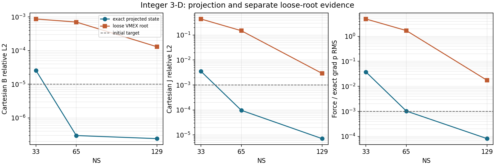

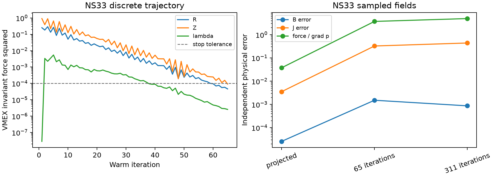

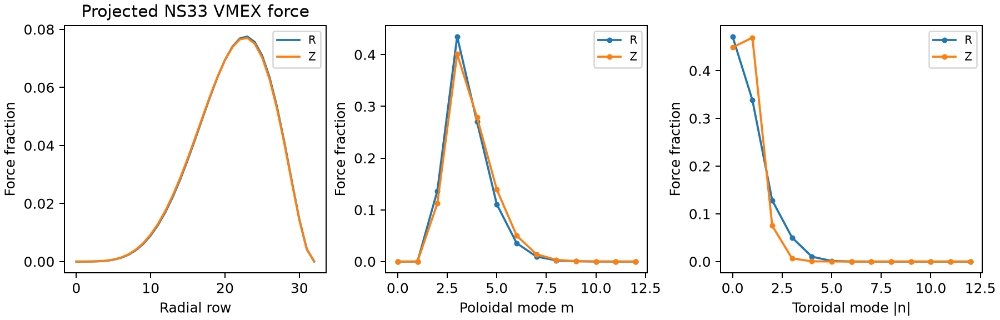

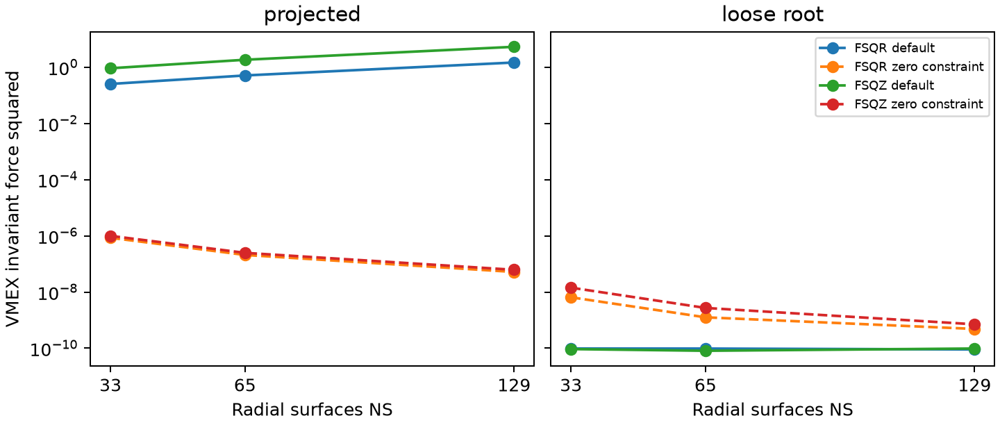

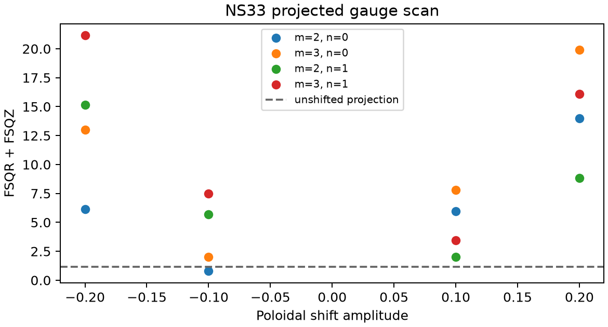

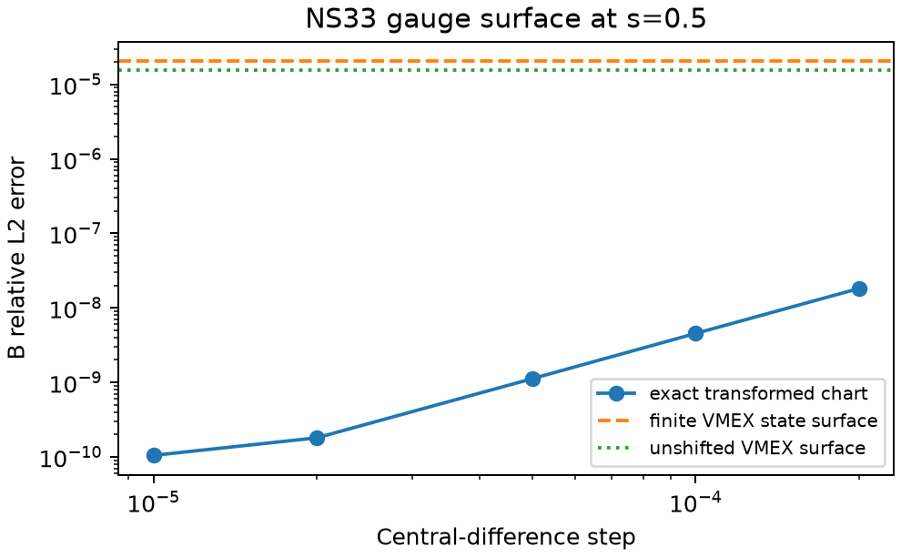

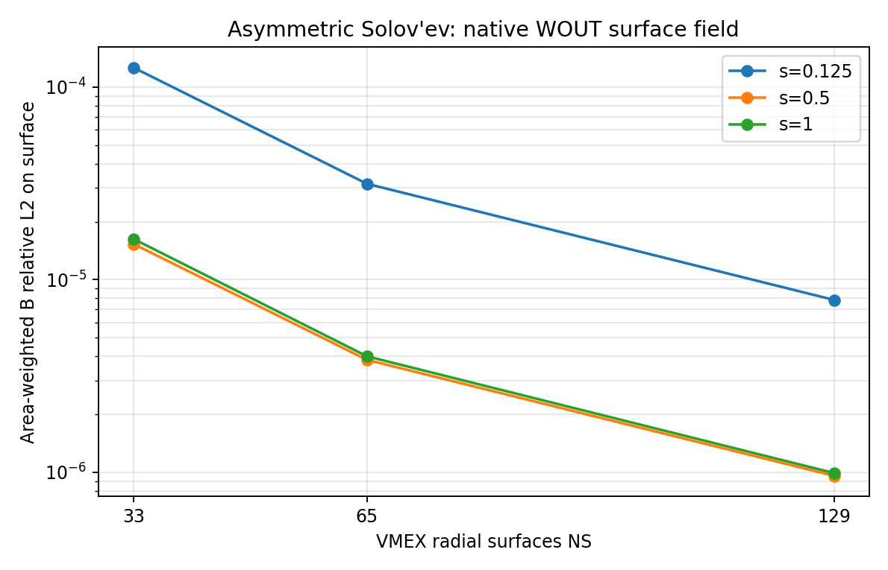

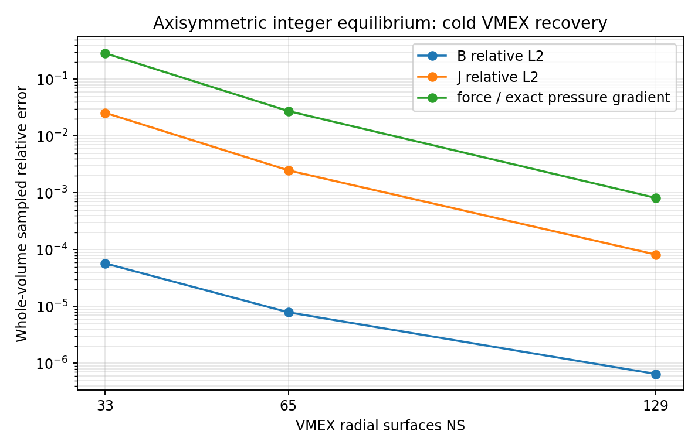

## Native VMEX and DESC coordinate comparison

These comparisons score native states at the same 96 held-out Cartesian points against the independent analytical B, J and pressure-gradient fields. Projection errors and solver outputs remain separate. VMEX is shown at `NS=129`; DESC uses angular `M=N=6` and `8`, with radial `L=8` and `10`, respectively. These resolutions and bases are not equivalent, so the plots compare measured physical errors, not solver rank.

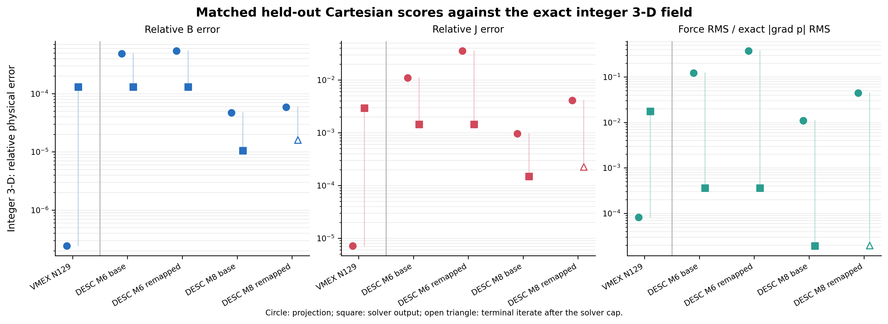

For the integer 3-D case, the VMEX exact-state projection at `NS=129` scores B/J relative L2 errors `2.42e-7 / 7.14e-6`; its separate loose-tolerance solved state scores `1.30e-4 / 2.92e-3`. DESC's base-chart projection improves from `4.84e-4 / 1.10e-2` at `M=N=6` to `4.69e-5 / 9.65e-4` at `M=N=8`. Its fixed-boundary force-balance solve at `M=N=8` reaches `1.05e-5 / 1.48e-4` and force RMS divided by exact pressure-gradient RMS `1.91e-5`.

The DESC remap is `theta_new = theta_old + 0.1 s(1-s) sin(2 theta_new)`, with the compensating lambda and unchanged physical boundary. At `M=N=6`, remapping raises projected J error from `1.10e-2` to `3.55e-2`, while converged base/remapped solver outputs agree to about `0.1%` in both B and J error. At `M=N=8`, the remapped projection scores `5.85e-5 / 4.10e-3`; after 120 iterations its terminal state scores `1.60e-5 / 2.25e-4`, but DESC reports that the optimizer did not converge. That point is shown as an open triangle and is not counted as a recovered equilibrium. The base/remapped results show finite-projection sensitivity and recovery compensation in DESC; they do not certify gauge-independent derivatives or show that mismatch is harmless in general.

An independent continuum check of this remap reconstructs B from the flux-scaled Clebsch lambda and differentiates the mapped covariant field to obtain curl B. Across five interior surfaces, B relative L2 error was at most `2.59e-10`; curl-B relative L2 error was at most `1.16e-4` over the radial-step study. The map derivative `d(theta_old)/d(theta_new)` stayed between `0.95` and `1.05`, and the oriented Jacobian kept its sign on all sampled nodes. This is a sampled continuum B/J certificate for one remap; it does not certify DESC or VMEX equilibrium-response derivatives, all volume points or other gauge modes. The record is [results/projection/integer_3d_gauge_volume_continuum.json](results/projection/integer_3d_gauge_volume_continuum.json).

The maximum exact-LCFS fit error was `5.95e-5 m` at DESC `M=N=6, L=8` and `4.15e-6 m` at `M=N=8, L=10`; the remapped and base boundaries agree to the reported precision. DESC's minimum sampled volume Jacobian stayed positive (`3.95e-3` to `4.06e-3` in the 3-D samples). These are sampled/projection checks, not a global proof that the coordinates remain regular everywhere.

The axisymmetric integer control gives a separate check. DESC `M=N=6, L=8` projection errors are `1.12e-5 / 2.15e-4`; after six optimizer iterations they are `1.99e-6 / 8.72e-6`. The VMEX `NS=129` solved control is `6.51e-7 / 8.24e-5`. Its higher radial resolution precludes a direct rank claim.

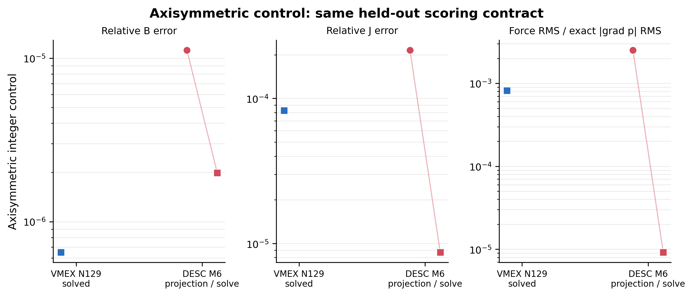

### VMEX coordinate-constraint ladder

At pinned VMEX `b5f5267`, six `NS=33` integer-3D solves used `FTOL=1e-10`, with `TCON0=1` (deck default), `0.1`, or `0`, from both a cold start and the independently certified projected state. Every solve met VMEX's discrete stopping test. None met the physical recovery targets `E_B <= 1e-5`, `E_J <= 1e-3`, and pressure-normalized force RMS `<= 1e-3`; solver convergence is not analytical recovery.

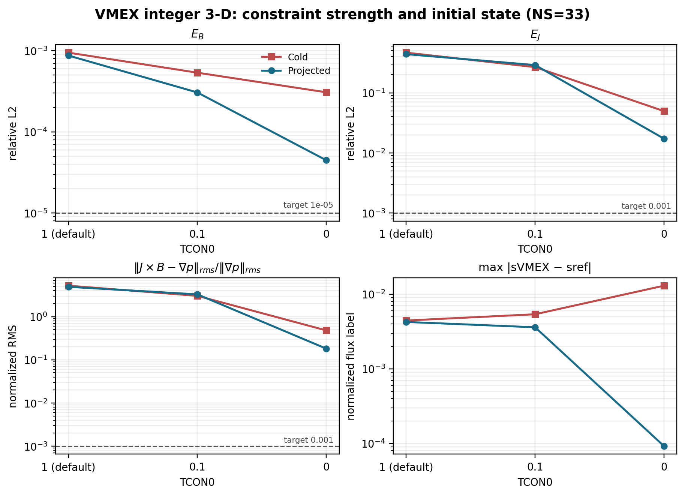

The projected zero-constraint run was the best of these six: `E_B=4.48e-5`, `E_J=1.73e-2`, force ratio `0.182`, and maximum normalized-flux-label drift `9.20e-5`. At default strength its errors were `8.71e-4`, `0.439`, and `4.93`, with label drift `4.24e-3`. From a cold start, `TCON0=0` improved B/J/force over default but increased label drift to `1.30e-2`; `TCON0=0.1` had lower physical errors than default and drift `5.38e-3`. Thus the term changes the recovered finite-resolution state, and its effect depends on initialization. The results support neither treating the constraint as harmless nor removing it globally. A multi-resolution, gauge-stability and derivative study is still required before changing the default or redesigning VMEX's coordinates.

The [machine-readable summary](results/vmex/tcon_ladder_ns33/summary.json) links each score and 96-point native sample array to its run record and hash. The six solve times were `13.9–17.1 s`, native sampling took `89.4–94.2 s` after increasing the scorer batch size, and process peak RSS was `3358–3513 MiB`. Comparing scorer batch sizes 8 and 32 on the same projected state changed B by at most `3.22e-15 T`, J by `4.10e-7 A/m^2`, and grad p by `4.01e-8 Pa/m`, with identical points, weights, and reference labels; the physical score differences were at roundoff. The strict-tolerance launch that omitted the explicit `BENCH_FTOL` environment setting is documented separately and excluded from the six-run matrix.

These runs prescribe iota. The cold zero-strength run's larger label drift shows that the finite-dimensional coordinate response is initialization-sensitive. The projected radial comparison extends through NS129 for default `TCON0`, but the zero-strength NS129 case remains unrun. Complete that case, then measure Jacobian regularity, high-mode content and gauge/derivative stability before drawing a design conclusion. Full records and reproducible plotting inputs are under [results/vmex/tcon_ladder_ns33](results/vmex/tcon_ladder_ns33).

The projected-start radial check supports that caution. At `NS=65`, zero strength reaches `E_B=8.26e-6` but still has `E_J=1.51e-3` and force ratio `1.67e-2`; default strength scores `7.06e-4 / 1.49e-1 / 1.70`. At `NS=129`, the default result improves to `1.30e-4 / 2.92e-3 / 1.74e-2`, but misses all three targets. The projected `TCON0=0` run at NS129 is **not run**; do not infer its result from the lower-resolution trend.

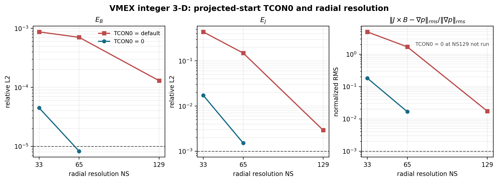

The [partial resolution summary](results/vmex/tcon_resolution_ladder/summary.json) contains five scored projected starts at NS33/65/129, their commands, raw discrete residuals, timings, RSS, native samples and hashes. The sixth cell, NS129 with zero strength, remains explicitly unrun. This is not a resolution-converged recovery result.

DESC used the pinned source revision in [sources.json](sources.json), version `0.17.3+27.g4f48720be`, JAX `0.6.2`, float64 and one CUDA device. Its environment record is [results/desc/environment.json](results/desc/environment.json). It prescribed the DESC rotational-transform profile `+2`; the transform was not independently measured in these runs. Projection/solved scorer records, compressed held-out arrays, equilibrium files and figure input hashes are under [results/desc/coordinate](results/desc/coordinate). The report records timings and peak resident memory. These measurements are a first native comparison, not the full P3 exit: current-closure checks, more remaps, explicit transform measurement, independent source/test review, higher-resolution VMEX TCON0 comparisons, VMEC2000/VMEC++ and GVEC comparisons, and derivative stability remain open.

## Candidate VMEX inputs

`inputs/` contains 28 generated INDATA candidates: 14 configurations, each with prescribed iota and prescribed current. The current profile is generated from an independent Ampere integral and converted to VMEX's derivative-profile convention. Pressure, flux and geometric scales are recorded in [inputs/manifest.json](inputs/manifest.json).

The regenerated boundary candidates use `(MPOL, NTOR) = (17, 96)` for sheared B and `(25, 100)` for sheared C. Their independent sampled Fourier-fit maxima are 8.59e-9 m and 3.34e-7 m at a 1 m length scale, below the 1e-6 m smoke gate. VMEX's pinned parser and setup accepted all 28 candidates: their sign map has `signgs=-1` and no unexpected theta flip, and sampled pressure, iota or normalized current agree with the independent reference fits. The details are in [results/inputs/vmex_parser.json](results/inputs/vmex_parser.json). These checks do not certify the final output error budget or an equilibrium solve.

The [sheared-chart check](results/reference/sheared_chart.json) sampled all six sheared variants on five radii, 64 poloidal labels and 513 toroidal nodes, plus 1024 independent physical-angle inversions per case. Every sampled angle map was monotone; the smallest normalized angular slope was 0.436 for sheared C. A [local implicit-root JVP check](results/reference/sheared_derivative.json) compared physical-position directional derivatives with independent central differences at four steps for two interior points each in A, B and C. Its smallest directional errors per point were 7.38e-13 to 1.95e-12 in reference length units. The branch-boundary and full input-map derivatives remain untested.

A [near-domain probe](results/reference/sheared_domain_edges.json) found that the smooth analytical domain does not alone guarantee a single-valued physical-angle chart. In sheared C with `S - asin(sqrt(2 edge))` of 0.001, 0.01 and 0.1, sampled minimum angle slopes were -3.22, -2.22 and -0.209, with three chart crossings at selected physical angles. The new sampled graph guard rejects these inputs before deck generation. The tested margins 0.2 and above had positive sampled slopes; their graph validity outside the sample is unproved.

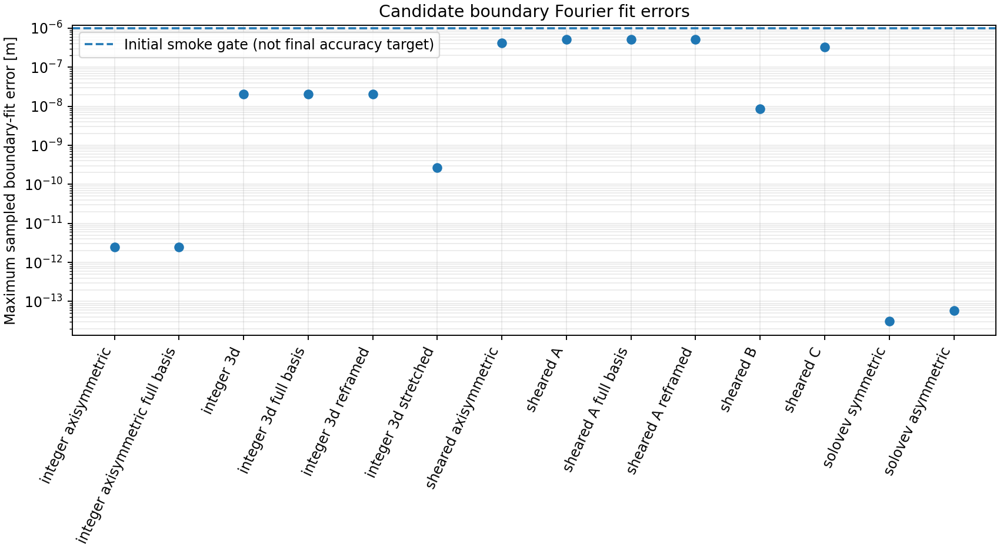

After installing the pinned VMEX and its dependencies in a separate local environment:

```sh
python benchmarks/run_vmex.py inputs/input.integer_axisymmetric_iota
python benchmarks/run_vmex.py inputs/input.integer_axisymmetric_current
python benchmarks/run_gradient_smoke.py inputs/input.integer_axisymmetric_iota
```

The forward runner now saves native Cartesian samples and physical scores after a converged solve. The gradient smoke remains unrun; it varies only PHIEDGE at fixed boundary and profiles and does not differentiate the complete analytical family. Complete the other recovery and derivative checks in phases P2-P4 before broader claims.

The shared scorer accepts an NPZ file of **native physical samples**, with its contract in the script and plan:

```sh
python benchmarks/score_samples.py samples.npz scores.json
```

It compares Cartesian B, J and grad p against the reference at the same points. Its `accepted` field remains unset until the experiment's resolution and error gates have been applied.

## Study coverage

The [execution matrix](benchmark_matrix.json) records implemented, planned and blocked experiments. The plan covers axisymmetric and non-axisymmetric equilibria, LASYM=F/T, genuine asymmetric Solov'ev physics, exact coordinate changes, both current/transform closures, field derivatives, implicit responses, file/restart paths, Boozer and bounce diagnostics, polishing, free-boundary operators and coupled roots, source fitting, optimization and scoped adjacent-code integrations.

An exact interior field is not automatically an exact free-boundary solution. The free-boundary plan distinguishes exact vacuum/operator tests, independently converged numerical coupled equilibria, and approximate exterior fits to an exact interior target. Genuinely symmetry-broken 3-D extensions outside the exact families also require numerical references. These distinctions are part of the benchmark, not missing labels to be filled with assumed answers.

The fixed-boundary VMEX recovery and first fixed-boundary DESC comparisons described above are the nonlinear solver measurements so far. No free-boundary or kinetic benchmark has run. The [public benchmark repository](https://github.com/rogeriojorge/vmex-benchmark-analytical) was created using the verified owner's authentication. [The source review](docs/SOURCE_REVIEW.md) identifies inspected paths and the full local semantic audit still needed; an inventory and focused parser review are not a whole-source semantic review.

## Local source inventory and publication

Resolve the used pins in `sources.json`, locate checkouts outside this repository, then run:

```sh
python tools/audit_sources.py /absolute/path/to/checkouts
sh tools/publish.sh
# Read the staged diff before authorizing publication:
PUBLISH=1 sh tools/publish.sh
```

The inventory tool does not mark files reviewed. The publication helper verifies the authenticated owner and configures only local Git identity; it does not force-push or rewrite history. Preserve third-party notices. Update the phase table and append a logbook entry after each meaningful experiment.

## License and references

Original code: MIT. See [NOTICE.md](NOTICE.md) for attribution and [plan.md](plan.md#references) for the scientific and implementation references. Large future state files should be checksummed release assets, while code, small numerical summaries and figure generators remain in Git.
