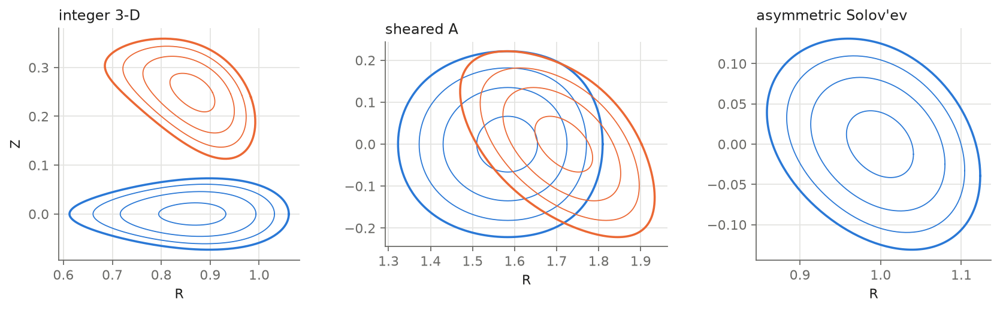
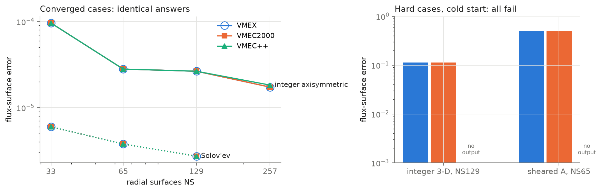
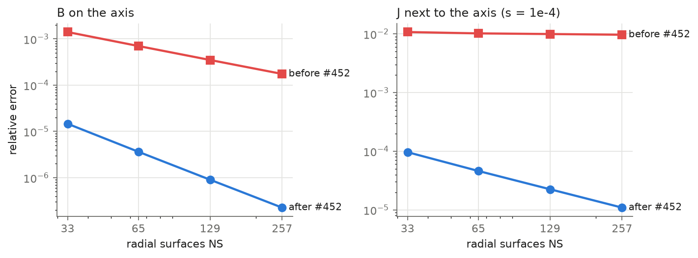
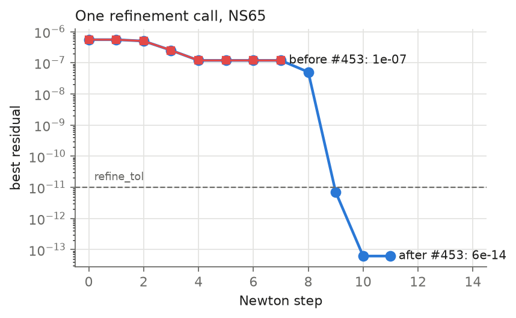
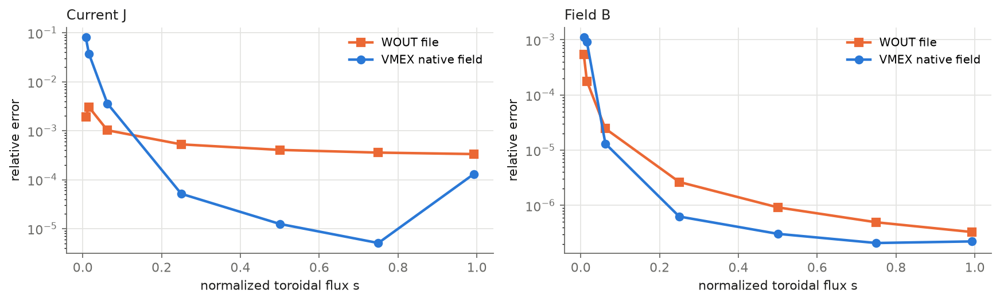
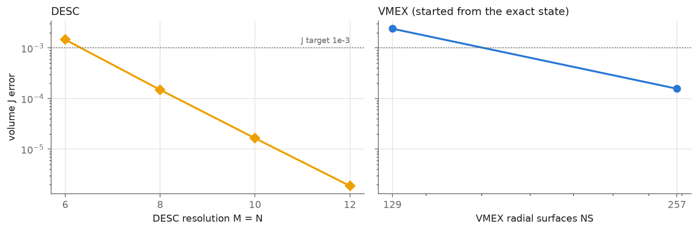
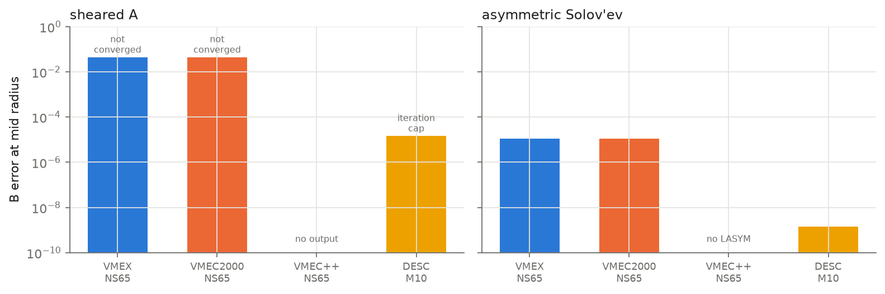

# Testing MHD equilibrium codes against exact solutions

This repository compares four ideal-MHD equilibrium codes against equilibria whose answer is known exactly: VMEX, VMEC2000, VMEC++ and DESC. The comparison found two defects in VMEX, both fixed upstream, and shows where each code is accurate and where it is not.

## What is compared

**Codes.** All versions are pinned; each run records its exact commit or binary hash.

| Code | Version | Notes |
|---|---|---|
| [VMEX](https://github.com/uwplasma/vmex) | main `3b73d6f` | JAX port of VMEC with a continuous field evaluator and implicit derivatives |
| [VMEC2000](https://github.com/PrincetonUniversity/STELLOPT) | STELLOPT `3e1439d` | Reference Fortran code |
| [VMEC++](https://github.com/proximafusion/vmecpp) | 0.5.2 | C++ reimplementation of VMEC |
| [DESC](https://github.com/PlasmaControl/DESC) | `4f48720` | Pseudo-spectral code with a Zernike basis in the poloidal cross-section |

**Exact solutions.** Most tests of 3-D equilibrium codes compare one code with another or with a finer run of itself. Neither check can catch an error that is the same at every resolution. [Landreman (2026)](https://arxiv.org/abs/2609.26742) found closed-form 3-D equilibria with finite pressure and nested flux surfaces. For these, B, J, the pressure and the flux surfaces are known at every point, including the magnetic axis. This benchmark uses two of his families, an integer-transform family and a sheared family, plus two Solov'ev tokamak equilibria. One of those is an up-down asymmetric variant derived here.



*Exact flux surfaces. Blue: toroidal angle 0; orange: a quarter field period later. The asymmetric Solov'ev case is axisymmetric.*

**Scoring.** VMEX, VMEC2000 and VMEC++ read the same generated input file. Each output is scored against the exact solution by the same script, using three measures:

- **Flux-surface error:** how far each computed flux surface lies from the exact one. This is pure geometry.
- **B and J errors,** relative to the exact field.
- **Axis position.**

DESC is run at its own spectral resolution and scored by evaluating its fields at chosen points.

## Main results

- VMEX, VMEC2000 and VMEC++ give the same equilibrium from the same input. VMEX's improvements are elsewhere: in how fields are read out, and in its derivatives.
- The exact solutions exposed two VMEX defects that resolution studies had missed. Fixes: [uwplasma/vmex#452](https://github.com/uwplasma/vmex/pull/452) (field at the axis) and [#453](https://github.com/uwplasma/vmex/pull/453) (derivative refinement), both merged.
- VMEX's continuous field gives J 10–70× more accurately than the standard WOUT output file, except within a few surfaces of the axis.
- DESC is the most accurate code in this comparison, including at the axis, and it recovers the cases where the VMEC-type codes fail from a cold start.

## Results

### 1. Same input, same equilibrium

The three VMEC-type codes solve the same discrete equations. On every case where they converge, their flux surfaces agree to the plotted precision, and VMEX and VMEC2000 agree on every score to all printed digits. They also fail together. From a cold start, none of them reaches the integer 3-D or sheared-A equilibria; their flux-label errors are 0.1 and 0.5. VMEC++ writes no output in those cases.



*Left: converged cases; the three codes overlap. Right: hard cases from a cold start.*

### 2. VMEX fix: the field at the axis (#452, merged)

VMEX evaluates B and J between its radial surfaces by interpolating Fourier coefficients. Each coefficient is scaled near the axis so that it stays smooth. The axis value of that scaled coefficient was copied from the first surface instead of extrapolated. As a result, the axis field was only first-order accurate, and the current next to the axis stayed wrong at the 1% level no matter how many surfaces were used. Only an exact solution shows an error like this: the axis field is known exactly, and the error does not go away under refinement. With linear extrapolation both errors converge.



*The exact solution projected onto VMEX's representation, with no solve, so only the evaluator is tested. Integer 3-D case.*

### 3. VMEX fix: refinement before derivatives (#453, merged)

Before computing derivatives, VMEX refines the equilibrium with Newton steps until the force residual is below `refine_tol`. When the first step overshot, the refinement stopped early and derivatives were taken at an unconverged state. It now restarts from its best point, at most twice. On the case below one call goes from 1e-7 to 6e-14.



*Integer axisymmetric case, NS65, starting from the same solver state.*

### 4. Reading B and J from an equilibrium

VMEC2000 and VMEC++ provide their result as a WOUT file. The file stores the field on a staggered radial grid and the current as a derived quantity. VMEX also provides a continuous field, `VmecInteriorField`, that can be evaluated anywhere. The plot evaluates both at the same points of one equilibrium, VMEC2000's own output. Between s = 0.25 and 0.75 the native field gives J 10–70× more accurately, and B is also better. Within the first few surfaces of the axis the WOUT current is better.

The WOUT format fixes what is stored, and VMEX writes it the same way as VMEC2000 so that existing tools keep working. The more accurate route is therefore the native field, not a different WOUT file. VMEX users get it directly in Python; users of VMEC2000 and VMEC++ can convert a WOUT with `vmex.state_from_wout` and use the same evaluator.



*Integer axisymmetric case, NS129, one VMEC2000 equilibrium read two ways.*

### 5. Integer 3-D: DESC and VMEX

For the integer 3-D case, DESC converges spectrally: the volume current error falls by about ten for each increase of the resolution by two. VMEX solves this case only when started from the exact state. It then reaches J errors of about 1e-4 at NS257, limited by the first cells next to the axis (see *Open problems*).



*Volume-averaged J error. The two panels use different resolution parameters, so compare the levels, not the slopes.*

### 6. Sheared A and the asymmetric Solov'ev case

Sheared A has strong magnetic shear and a large pressure. The VMEC-type codes do not converge on it, while DESC reaches B errors near 1e-5 at M = 10. DESC did not meet its own stopping tolerance within 150 iterations there, so the figure marks it. For the asymmetric Solov'ev case VMEX and VMEC2000 converge. DESC is much more accurate there, partly because this solution is a low-order polynomial that its basis represents almost exactly. VMEC++ does not support up-down asymmetric (LASYM) equilibria.



*B error at mid radius (s near 0.5).*

## Open problems

- **Near-axis current in solved VMEX states.** After #452 the exact projection is accurate at the axis, but solved states still carry a current error of about 1e-2 in the first two or three cells. The error is the same at NS129 and NS257. VMEC2000 gives the identical solution, and smoothing the first surfaces does not remove it. It is therefore a property of the VMEC discretization near the axis, not of the evaluator, and a fix would change that discretization.
- **Sheared A in VMEC-type codes.** Cold starts end on a wrong state, and a solve started from the exact state drifts away from it. VMEC2000 and VMEC++ behave the same way; DESC does not.

## Reproduce

```sh
python -m pip install -r requirements.txt
python -m pytest -q                        # exact-solution checks (no solver needed)
python benchmarks/verify_reference.py      # force balance of every exact case
```

With VMEX, VMEC2000 (`xvmec2000`) and VMEC++ installed:

```sh
python benchmarks/cross_code_run.py --deck input.integer_axisymmetric_iota --ns 129 --code vmec2000
python benchmarks/score_wout_exact.py --run-dir results/cross_code/runs/integer_axisymmetric_iota-ns129-vmec2000 --case integer_axisymmetric
python benchmarks/cross_code_summary.py
python benchmarks/plot_figures.py
```

DESC cases run with `benchmarks/desc_general_case.py --case integer_3d --M 8 --output-dir <dir>`. The two fix reproductions are `benchmarks/axis_projection_ladder.py` and `benchmarks/observe_root_refinement.py`.

## Layout

- `benchmarks/analytic.py`: the exact solutions. `build_inputs.py` writes the input decks in `inputs/`.
- `benchmarks/cross_code_run.py`, `score_wout_exact.py`, `cross_code_summary.py`: the VMEX, VMEC2000 and VMEC++ comparison.
- `benchmarks/desc_general_case.py`: DESC runs.
- `benchmarks/plot_figures.py`: every figure, drawn from `results/` only.
- `results/`: per-run receipts (input hash, code version, command) and scores.

The full development history, including earlier diagnostics and plans, is kept at the git tag `archive-2026-09-25`.

## References

- M. Landreman (2026), [arXiv:2609.26742](https://arxiv.org/abs/2609.26742); supplement [landreman/analytic_3d_equilibria](https://github.com/landreman/analytic_3d_equilibria).
- S. P. Hirshman and J. C. Whitson, *Steepest-descent moment method for three-dimensional magnetohydrodynamic equilibria*, Phys. Fluids 26, 3553 (1983). (VMEC)
- D. W. Dudt and E. Kolemen, *DESC: A stellarator equilibrium solver*, Phys. Plasmas 27, 102513 (2020).
